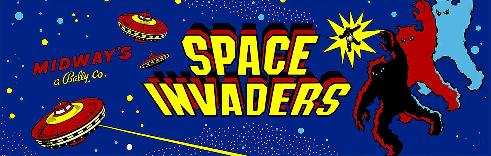

# 🛸 Space Invaders Game (C Version)



A classic Space Invaders game implemented in C with modular design and continuous gameplay.

## Table of Contents
- [Overview](#overview)
- [Features](#features)
- [File Structure](#file-structure)
- [Installation](#installation)
- [Controls](#controls)
- [Future Scope](#future-scope)
- [Credits](#credits)

## Overview

This project implements a **🎮 Space Invaders** game using C, aiming to recreate the classic arcade experience. The game features player-controlled spaceships, alien waves, and continuous gameplay with a scoring system. It demonstrates modular design with separate modules for handling different game elements such as the spaceship, aliens, and lasers.

## Features

- **Player-controlled spaceship**: Move left and right at the bottom of the screen and shoot lasers.
- **Alien waves**: Aliens move across the screen and shoot back at the player.
- **Endless waves**: Aliens respawn after being cleared, ensuring continuous gameplay.
- **Game Over condition**: The game ends when all player lives are lost.

## File Structure

- `assets/`: Game assets (images)
  - `enemy.png`: Alien sprite
  - `player.png`: Spaceship sprite
- `src/`: Source files
  - `main.c`: Entry point of the game
  - `game.c`: Game logic
  - `spaceship.c`: Spaceship logic
  - `alien.c`: Alien logic
  - `laser.c`: Laser logic
- `include/`: Header files
  - `game.h`: Game logic header
  - `spaceship.h`: Spaceship logic header
  - `alien.h`: Alien logic header
  - `laser.h`: Laser logic header
- `CMakeLists.txt`: CMake configuration file for building the project
- `README.md`: This README file

## Installation

### Prerequisites

- **GCC Compiler**: Ensure you have GCC installed on your system.
- **CMake**: Required for building the project.
- **raylib**: Game development library used for rendering.

### Cloning the Repository

1. Clone the repository from GitHub:
    ```
    git clone https://github.com/yourusername/space-invaders-c.git
    ```
2. Navigate into the project directory:
    ```
    cd space-invaders-c
    ```

### Build the Project

1. Create a build directory and compile the project using CMake:
    ```
    mkdir build
    cd build
    cmake ..
    make
    ```

## Controls

- **Move Left**: Left Arrow Key
- **Move Right**: Right Arrow Key
- **Shoot**: Space Bar

## Future Scope

- **Levels**: Introduce levels with increasing difficulty.
- **Power-ups**: Implement power-ups for the player (e.g., double lasers, shields).
- **Alien Types**: Add more diverse alien types with different behaviors.
- **Multiplayer**: Add a two-player mode with simultaneous play.
- **Improved Graphics**: Enhance the visual quality of the game with more detailed sprites and animations.

## Credits

- **raylib**: For providing an easy-to-use game development framework.
- **Game Development**: Developed by Karan Kapoor.
- **Inspiration**: Based on the classic arcade game, Space Invaders.
